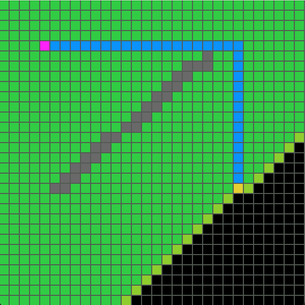

# Pathfinding Visualization with Pygame


## Overview 

This Python program visualizes pathfinding algorithms (currently supports BFS) using Pygame. It allows users to interactively set start points, target points, and draw obstacles on a grid.

## Requirements

- Python 3.x
- Pygame library (`pip install pygame`)

## Usage

1. **Clone the repository:**

   ```bash
   git clone https://github.com/tymoteuszmilek/path-finding-visualization.git
   cd pathfinding-visualization

2. **Install the required dependencies:**
     
      ```bash
      pip install -r requirements.txt
      ```
      
3. **Run the program:**
   
      ```bash
      python main.py
      ```
      
4. **Instructions**
  - **draw walls** hold left click and drag to draw
  - **set start position** right click on desired position 
  - **set target position** right click on desired position
  - **start algorithm** press any key to start 
